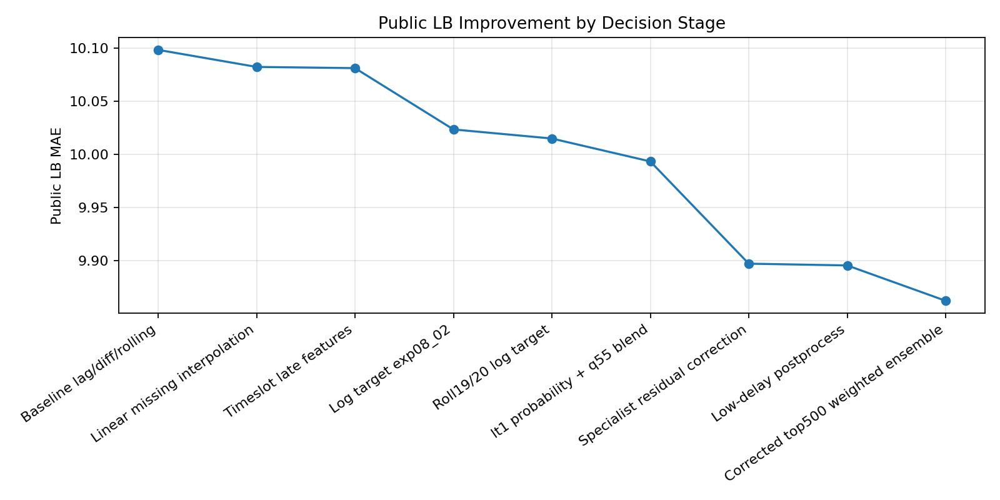

# 물류 출고 지연 예측

향후 30분 평균 출고 지연 시간 `avg_delay_minutes_next_30m`를 예측하는 프로젝트입니다.

## 핵심 결과

- Public LB 개선 흐름: `11.03 -> 9.86대`
- 최종 제출 기록: `9.8621714902`
- 동일 코드로 재학습하더라도 `outputs/` 없이 처음부터 학습하는 경우, 실행 환경과 라이브러리 버전에 따라 결과가 소폭 달라질 수 있습
니다.
- 주요 모델 축: `LightGBM` 기반 회귀 + `log1p` 타깃 + `q=0.55` quantile 보조 + 저지연 보수 보정
- 검증 방식: `GroupKFold` + target-heavy holdout bin report



## 폴더 구조

```text
organ_github/
├─ README.md
├─ requirements.txt
├─ data/
│  ├─ README.md
│  ├─ sample_submission.csv
│  └─ raw/
│     ├─ train.csv
│     ├─ test.csv
│     └─ layout_info.csv
├─ reports/
│  ├─ 03_validation_strategy_ko.md
│  └─ figures/
├─ results/
│  └─ validation/
│     └─ decision_timeline.csv
└─ src/
   ├─ config.py
   ├─ data_io.py
   ├─ eda.py
   ├─ feature_engineering.py
   ├─ modeling.py
   ├─ validation.py
   ├─ submission.py
   └─ pipeline.py
```

## src 안내

| File | Purpose |
|---|---|
| `src/config.py` | 경로, 타깃명, 공통 상수 |
| `src/data_io.py` | 원본 데이터 로드와 저장 헬퍼 |
| `src/eda.py` | 타깃 분포, 결측률, 시나리오/레이아웃 요약 |
| `src/feature_engineering.py` | 전처리, target<1, lag/diff/rolling, backlog, interaction 피처 생성 흐름 |
| `src/modeling.py` | wide_tail_quantile, context_rolling, specialist blend, final ensemble 모델링 흐름 |
| `src/validation.py` | GroupKFold OOF 요약, target-heavy holdout, bin report, submission 검증 |
| `src/submission.py` | 최종 제출 파일 생성 및 검증 |
| `src/pipeline.py` | 전처리, 모델링, 검증, submission 순서가 보이도록 정리한 전체 실행 스크립트 |

## 전처리 / 피처 엔지니어링

1. 기본 lag / diff / rolling 피처
   - `build_base_lag_roll_features()`에서 원본 train/test를 읽고 기본 피처 매트릭스를 만듭니다.
   - 주요 입력은 시계열성 있는 물류 지표이며, lag step은 `(1, 2, 3, 5, 10)`, rolling window는 `(19, 20)`을 기본 축으로 사용합니다.
   - beam search 로 1200가지 정도 돌려서 rolling window 와 lag step을 정했습니다.
   - 결측은 lag/rolling 구조에 맞춰 보간하고, 완전 중복 컬럼은 제거합니다.

2. `target < 1` 저지연 확률 피처
   - `add_target_lt1_probability_features()`와 `build_low_delay_probability_outputs()`가 담당합니다.
   - `avg_delay_minutes_next_30m < 1` 여부를 binary label로 보고 LightGBM classifier를 학습합니다.
   - train에는 OOF 확률(`lt1_clf_prob_oof`)을 붙이고, test에는 fold별 예측 평균 확률을 붙입니다.
   - 확률값 자체, 제곱값, 고확률 flag를 회귀 모델의 추가 입력으로 사용합니다.

3. delay-bin / wide-tail 보조 피처
   - `build_wide_tail_quantile_features()`에서 큰 지연 구간을 더 잘 잡기 위한 feature set을 구성합니다.
   - `target < 1` 확률 피처 위에 delay-bin classifier probability를 추가합니다.
   - 이후 0.55 분위수 회귀 모델의 입력으로 사용됩니다.

4. scenario rank / layout 피처
   - scenario 내부에서 원본 물류 지표의 rank, 상대 평균, z-score, max 대비 비율 등을 만듭니다.
   - base prediction의 scenario 내 위치도 피처로 사용합니다.
   - `layout_type`은 one-hot과 빈도 인코딩으로 추가합니다.

5. backlog / pressure / interaction 피처
   - `add_backlog_diff_cumulative_features()`에서 병목과 누적 압력을 표현하는 피처를 만듭니다.
   - 예시는 주문량 대비 포장/로봇 capacity gap, robot overload, downstream pressure, congestion과 pack/robot pressure의 상호작용입니다.
   - 이 피처들은 단순 원본값보다 “현재 물류 시스템이 얼마나 밀려 있는지”를 설명하기 위한 파생 변수입니다.

6. context rolling 피처
   - `add_context_rolling_features()`와 `build_context_rolling_feature_set()`에서 최종 주력 feature set을 만듭니다.
   - base prediction, scenario rank, backlog pressure 계열 피처를 scenario 내부에서 `shift(1)` 후 rolling mean/max/std로 요약합니다.
   - `shift(1)`을 사용해 같은 row의 target 정보가 직접 섞이지 않도록 했습니다.

## 모델링

모델링의 중심 파일은 `src/modeling.py`이고, 실행 순서는 `src/pipeline.py`에 단계별로 정리되어 있습니다.

1. base regression model
   - 주력 회귀 모델은 LightGBM 기반 `context_rolling_lgbm`입니다.
   - target은 `log1p(avg_delay_minutes_next_30m)`로 변환해 학습하고, 예측 후 `expm1`로 원래 단위로 복원합니다.
   - 검증은 scenario 단위 `GroupKFold` OOF와 target-heavy holdout을 같이 봅니다.

2. wide-tail quantile model
   - `wide_tail_quantile_alpha_0p55`는 큰 지연 tail을 보완하기 위한 0.55 분위수 모델입니다.
   - 일반 평균 회귀가 고지연을 과소 예측하는 문제를 줄이기 위해 context model과 blend 후보로 사용됩니다.

3. context + quantile blend
   - `context_rolling_lgbm` 예측과 `wide_tail_quantile_alpha_0p55` 예측을 weight grid로 비교합니다.
   - 최종 specialist blend의 base candidate는 이 두 모델의 조합입니다.

4. high / low specialist blend
   - `train_high_low_specialist_blend()`에서 고지연/저지연 구간별 가중 LightGBM specialist를 따로 학습합니다.
   - high specialist는 `target >= 40`, `50`, `100` 구간에 더 큰 sample weight를 줍니다.
   - low specialist는 낮은 지연 구간을 안정적으로 맞추도록 `target < 1`, `target < 5` 쪽에 가중치를 둡니다.
   - base blend 예측에 specialist residual을 부드럽게 섞는 방식으로 grid search를 수행합니다.

5. delay gate / low-delay postprocess
   - `delay_gate_probabilities`는 test row가 저지연일 가능성을 추정합니다.
   - 확률이 높은 구간에는 예측값을 보수적으로 낮추는 postprocess를 적용합니다.
   - 이 단계는 과대 예측이 LB에 불리한 저지연 구간을 줄이기 위한 보정입니다.

6. LGBM / XGB / CatBoost fallback ensemble
   - `train_lgbm_xgb_cat_fallback_ensemble()`에서 LightGBM, XGBoost, CatBoost 계열 예측을 함께 사용합니다.
   - 기존 context/quantile/specialist 예측을 참고 피처 또는 fallback 기준으로 삼고, weight grid와 stacking 후보를 비교합니다.
   - 최종 재학습 제출 파일은 `outputs/lgbm_xgb_cat_fallback_ensemble/submissions/corrected_weighted_ensemble_submission.csv`에서 만들어집니다.


## 실행

- 전체 실행: `python src/pipeline.py`